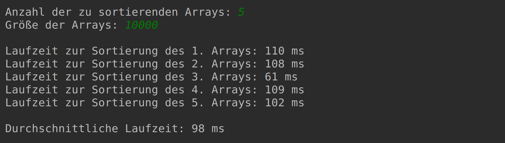

# Sort Complexity

## Ziele

- Implementierung eines Sortieralgorithmus
- Messung der Laufzeit des Sortierverfahrens
- Vergleich der Laufzeiten für unterschiedliche Arraylängen

## Implementierung

### main Methode

- Ein-/Ausgabe siehe Screenshot
- Aufruf von `sortRandomArray(...)` in einer entsprechenden Schleife
- Summierung der von `sortRandomArray(...)` zurückgegebenen Laufzeiten
- Berechnung der durchschnittlichen Laufzeit

### sortRandomArray Methode

- Generierung eines Arrays aus Zufallszahlen mithilfe von `generateRandomArray(...)`
- Sortierung des Arrays mithilfe von `sort(...)`
- Bestimmung der Systemzeit vor und nach dem Aufurf von `sort(...)` mithilfe von `System.currentTimeMillis()`
- Rückgabe der Laufzeit des Sortierverfahrens in Millisekunden

### generateRandomArray Methode

- Erzeugung eines Integer Arrays mit der übergebenen Länge
- Befüllung des Arrays mit Zufallszahlen
- Rückgabe des Arrays

### sort Methode

- Sortierung des Arrays mit einem beliebigen (selbst implementierten) Sortierverfahren
- Verwendung von `swap(...)`

### swap Methode

- Austausch der Array-Elmente mit den übergebenen Indizes

## Ausführung

Vergleichen Sie die Laufzeiten für folgende Eingabedaten:

- Arrayanzahl = 100; Arraygröße = 10 000
- Arrayanzahl = 100; Arraygröße = 20 000
- Arrayanzahl = 100; Arraygröße = 40 000